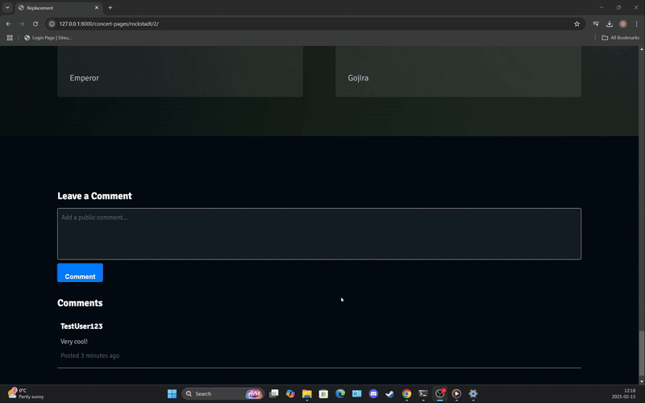

# 🎉 Easy Tickets

An interactive event listing platform built with **Django**, allowing users to explore, review, and purchase tickets for various events. The platform dynamically updates to highlight the most popular event, ensuring users never miss out on trending experiences.
The source of inspiration in the creation of this website is the famous **iaBilet** webiste, which does not inherently support a comment system as of the writing of this documentation.

## ✨ Features
- 🏆 **Dynamic Event Listings** – Browse and discover events in real time.
- 💬 **Comment & Review System** – Users can leave feedback on events.
- 🎟️ **Ticket Purchase System** – Securely buy tickets directly through the platform.
- 📌 **Popular Event Highlighting** – Displays the most popular event on the homepage.

## 🚀 Getting Started
### 1️⃣ Clone the Repository
```bash
git clone https://github.com/Simi445/Event-Listing.git
cd Event-Listing
```

### 2️⃣ Set Up Virtual Environment
```bash
python -m venv venv
source venv/bin/activate   # On Windows: venv\Scripts\activate
```

### 3️⃣ Install Dependencies
```bash
pip install -r requirements.txt
```

### 4️⃣ Apply Migrations
```bash
python manage.py migrate
```

### 5️⃣ Create a Superuser (for Admin Access)
```bash
python manage.py createsuperuser
```

### 6️⃣ Run the Development Server
```bash
python manage.py runserver
```
Visit **http://127.0.0.1:8000/** in your browser.

## 🎥 Showcase

### 🔑 The Login Feature
A demonstration of the user login process:


---

### 🔄 The Workflow of the Site
A short tour on how users might interact with the platform:


---

### 💬 The Comments System
Users can leave reviews and feedback on events:



---

### 🛒 The Purchasing Prototype
A preview of the ticket purchasing system:


## 🛠 Tech Stack
- **Backend:** Django, Django REST Framework
- **Frontend:** HTML, CSS, JavaScript
- **Database:** SQLite 
- **Authentication:** Django Auth

## 📜 License
This project is licensed under the MIT License.

## 🤝 Contributing
Pull requests are welcome! Open an issue for feature requests or bug reports.


